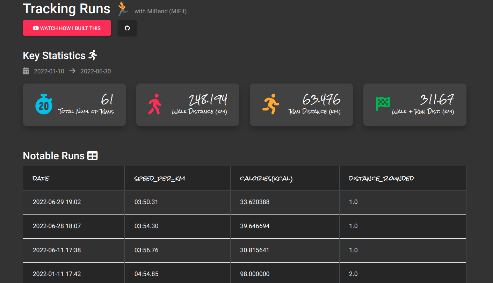
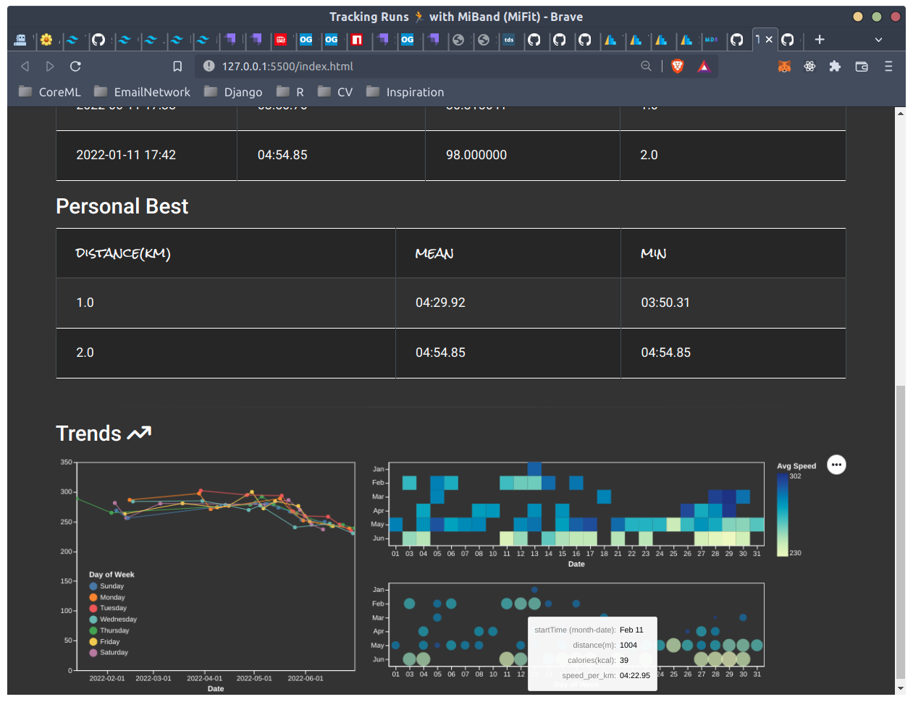
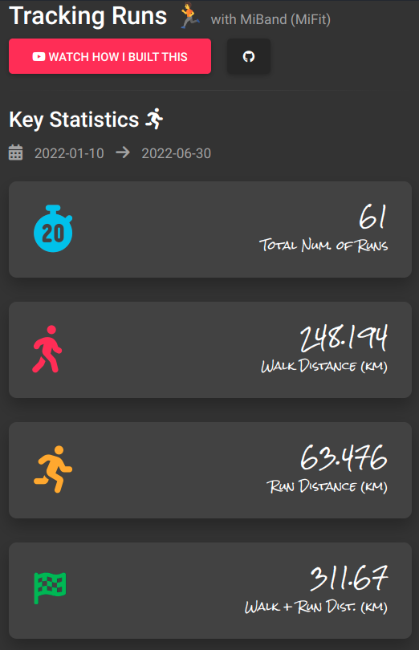

### MiBand Dashboard (Personal Analytics)

A personal dashboard to visualize my runs data collected from Mi Band / Mi Fit. 

It's not fanciful, but it clearly displays all the key statistics I care for, and it's incredibly easy to deploy thanks to the power of PyScript (Python in the browser) and Altair.

Live Demo: [Mi Band analytics dashboard](https://onlyphantom.github.io/miband/)

The dashboard is fully responsive / mobile-friendly. If you'd like to see how I build it, follow the [PyScript tutorial series on YouTube](https://www.youtube.com/watch?v=Qo8dXyKXyME&list=PLXsFtK46HZxXS9yBHkQXvaw1eLSIS5Mb-&index=1) where I demonstrate how to build tools with PyScript.

You can also [build this along with me](https://youtu.be/3mfqTGs05cE) on YouTube.

I have some ideas I have yet to incorporate into the app, and will do so gradually over the near future. You can Star the project to follow its progress, or subscribe to me on YouTube to follow me on this journey.

### Gallery

#### Exporting Data from Xiaomi Mi Fit / Mi Band
The data is exported from the Mi Fit service (Accounts > Settings > About > Personal Information Security > Exercising User Rights > Export).

> The Mi Fit app might have been renamed to Zepp Life.

#### Authors and Copyright

Samuel Chan, [Supertype](https://supertype.ai)
- Github: [onlyphantom](https://github.com/onlyphantom)

##### The MIT License (MIT)
Copyright (c) 2022 Supertype Pte Ltd

Permission is hereby granted, free of charge, to any person obtaining a copy of this software and associated documentation files (the "Software"), to deal in the Software without restriction, including without limitation the rights to use, copy, modify, merge, publish, distribute, sublicense, and/or sell copies of the Software, and to permit persons to whom the Software is furnished to do so, subject to the following conditions:

The above copyright notice and this permission notice shall be included in all copies or substantial portions of the Software.
THE SOFTWARE IS PROVIDED "AS IS", WITHOUT WARRANTY OF ANY KIND, EXPRESS OR IMPLIED, INCLUDING BUT NOT LIMITED TO THE WARRANTIES OF MERCHANTABILITY, FITNESS FOR A PARTICULAR PURPOSE AND NONINFRINGEMENT. IN NO EVENT SHALL THE AUTHORS OR COPYRIGHT HOLDERS BE LIABLE FOR ANY CLAIM, DAMAGES OR OTHER LIABILITY, WHETHER IN AN ACTION OF CONTRACT, TORT OR OTHERWISE, ARISING FROM, OUT OF OR IN CONNECTION WITH THE SOFTWARE OR THE USE OR OTHER DEALINGS IN THE SOFTWARE.